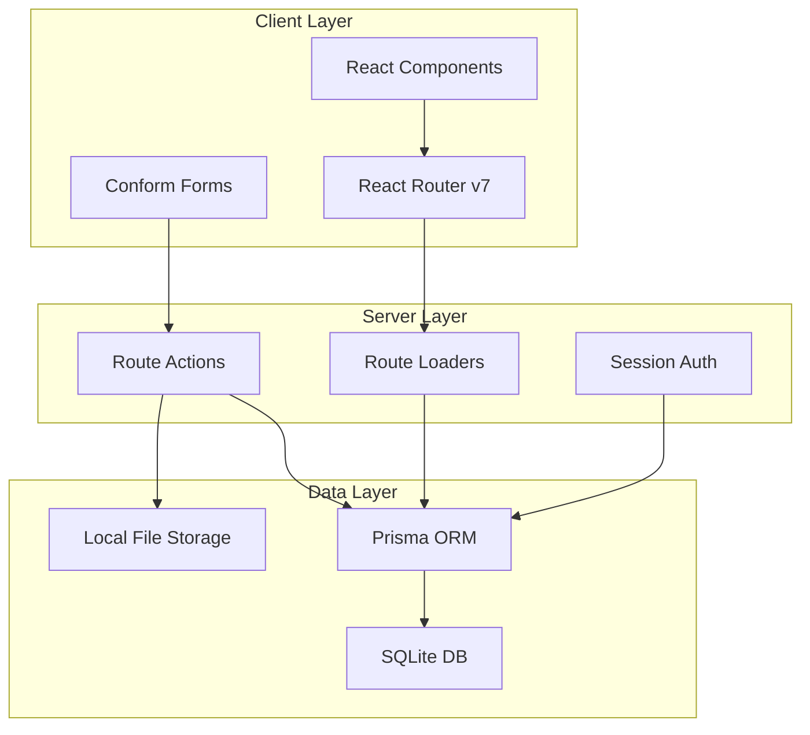

# Travel Journal Application - Implementation Plan

## Architecture Overview

```mermaid
graph TB
subgraph client [Client Layer]
UI[React Components]
Forms[Conform Forms]
Router[React Router v7]
end

subgraph server [Server Layer]
Loaders[Route Loaders]
Actions[Route Actions]
Auth[Session Auth]
end

subgraph data [Data Layer]
Prisma[Prisma ORM]
SQLite[SQLite DB]
FileStore[Local File Storage]
end

UI --> Router
Forms --> Actions
Router --> Loaders
Loaders --> Prisma
Actions --> Prisma
Actions --> FileStore
Prisma --> SQLite
Auth --> Prisma
```
