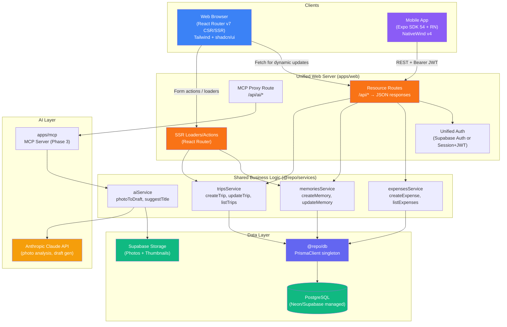
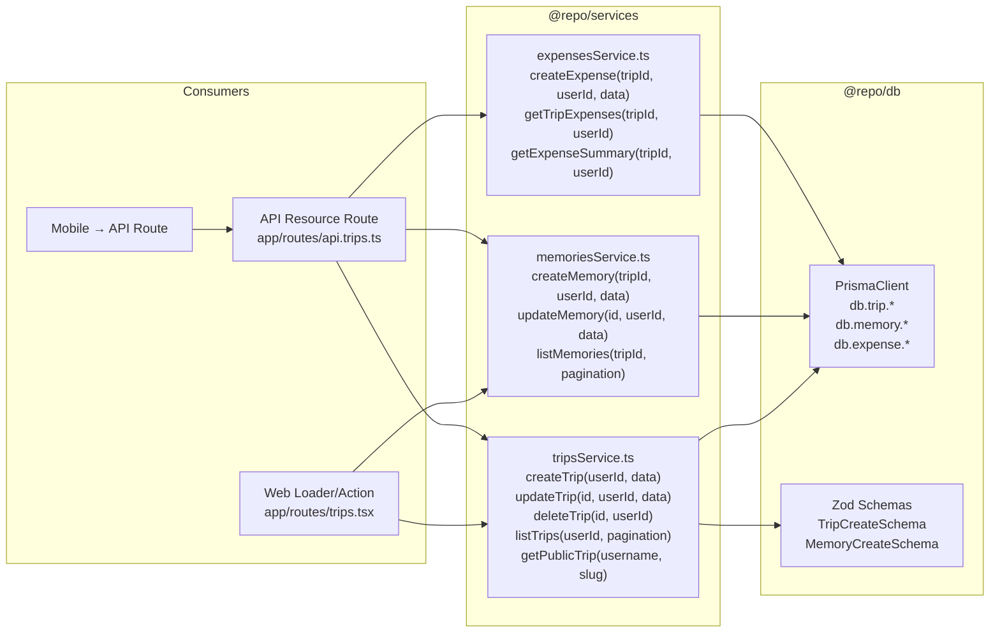
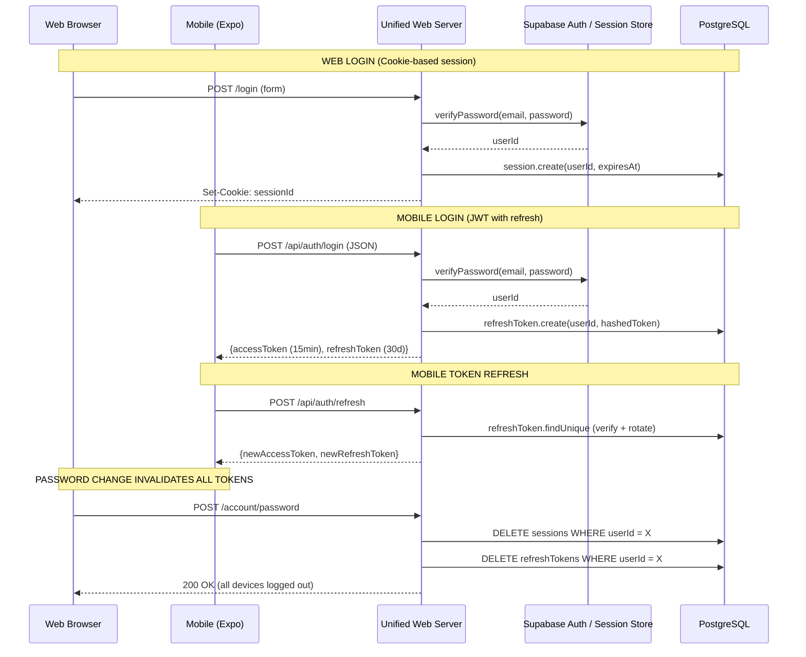
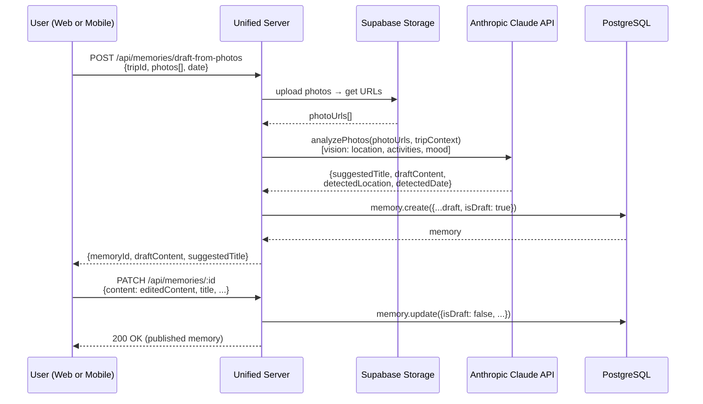

# Travel Journey — Final Strategic Plan
**Lead Synthesis | 2026-03-16**

> This report aggregates findings from 4 parallel research agents:
> - `business-product` (competitor analysis, market data, monetization)
> - `tech-architect` (architecture review, diagrams, Phase 3 readiness)
> - `ux-designer` (design audit, competitor UX, animation opportunities)
> - `devils-advocate` (challenged all three, identified red flags)

---

## 1. Go / No-Go Recommendation

### Verdict: **CONDITIONAL GO**

The product has a functional, well-built Phase 1 web app and a defensible niche. The conditional elements that must be resolved before proceeding to Phase 3:

| Condition | Status | Blocker? |
|---|---|---|
| Core web app feature-complete | ✅ Done | — |
| Photo upload/storage strategy defined | ❌ TBD in docs | Yes |
| Auth security gap resolved (JWT revocation) | ❌ Unfixed | Yes |
| Mobile core loop works (memory creation) | ❌ Unimplemented | Yes |
| Retention mechanism designed | ❌ None exists | No (Phase 3) |
| AI input mode prototyped | ❌ MCP app empty | No (Phase 3) |

### Rationale

**For:** The "private-first travel journal with selective public sharing" niche is genuinely underserved. Polarsteps is social-first. Day One is not travel-specific. Wanderlog is a planner, not a journal. The combination of private journaling + magazine-quality public pages + AI-assisted writing has no direct competitor executing all three well. The existing codebase is Phase 1-complete and well-structured.

**Against:** The market is small (people who journal AND travel frequently = narrow TAM). Google is entering with free AI itinerary generation. The app currently has no photo upload (the product's core), no retention mechanism, and a security gap between the web and mobile auth systems.

**The pivot that changes everything:** Reframe from "travel journal app" to "turn your travel photos into a beautiful story, automatically." AI-photo-to-draft is the killer differentiator and solves the blank page problem simultaneously. Without this, the app competes on features with established players and loses.

---

## 2. Tech Stack Recommendation

### Decision: **Keep existing stack with targeted fixes**

Do not change everything. The stack is modern, well-chosen, and not the constraint. The problems are architectural (dual auth, business logic duplication) and product (no photos, no AI, no retention) — not technical.

| Layer | Current | Recommendation | Reasoning |
|---|---|---|---|
| Web framework | React Router v7 (SSR) | Keep | SSR is critical for public trip page SEO and performance. RRv7 is the right choice. |
| API server | Hono on port 3001 | **Migrate to RR7 resource routes** | Eliminates dual auth, dual business logic, one deployment target. Mobile hits `/api/*` on the web server. See Architecture section. |
| Database | PostgreSQL + Prisma | Keep, use managed provider | Switch from self-hosted to Neon or Supabase (free tier). Eliminates `NODE_TLS_REJECT_UNAUTHORIZED=0` SSL issues. Supabase adds storage (photos) and auth as a bonus. |
| Mobile | Expo SDK 54 + NativeWind | Keep but deprioritize | Correct stack. But defer mobile parity until web is validated. Focus on fixing the critical mobile blocker (memory creation) first. |
| Auth | Cookie sessions (web) + JWT (mobile) | **Unify on Supabase Auth OR add JWT revocation** | Either option closes the security gap. Supabase Auth gives refresh tokens, revocation, and OAuth for free. |
| Photo storage | TBD | **Supabase Storage or Cloudinary** | Supabase Storage is free tier (1GB), integrated with the DB. Cloudinary gives auto-optimization. Pick Supabase for simplicity. |
| AI/MCP | Empty apps/mcp/ | **Prototype before infrastructure** | Build photo-to-draft in apps/web first. Extract to MCP package when interaction model is validated. |
| Monorepo | Turborepo + pnpm | Keep | Sound choice. Shared packages (@repo/db, @repo/types) provide genuine value. |
| Hosting | Not configured | **Railway ($5/mo) or Fly.io** | Single service (web app serves both web and mobile API). PostgreSQL on Neon free tier. Total cost: $0-5/month at low scale. |

### What to Eliminate

- **Separate Hono API (`apps/api`)**: Merge into React Router v7 resource routes. See Architecture recommendation.
- **Dual auth systems**: Unify. Both platforms should use the same session/token infrastructure.
- **Manual validation in API routes**: Already eliminated if API is merged. If kept, replace with `@hono/zod-validator`.

---

## 3. Architecture Recommendation

### Proposed Architecture: Web-First with Unified Server

The core insight from the devil's advocate: maintaining two separate backend systems (web SSR + Hono API) for a solo developer creates compounding maintenance burden. React Router v7 supports resource routes that return JSON, making it a capable API server.

### Abstraction Layer Design

The key architectural addition is `@repo/services` — a new shared package that holds all business logic. Both the web SSR layer and API routes call these functions instead of raw Prisma queries.

### Authentication Flow (Unified)

### Data Flow: Photo-to-Draft AI Entry (Phase 3 Core Feature)

---

## 4. Risk Register

Synthesized from the devil's advocate analysis, tech architect findings, and business-product research.

| # | Risk | Probability | Impact | Mitigation | Owner |
|---|---|---|---|---|---|
| **R1** | **Security: Password change doesn't revoke mobile JWT** | High | Critical | Add refresh token table to DB; short-lived access tokens (15min) + revocable refresh tokens (30d); DELETE all refresh tokens on password change | Phase 2 (immediate) |
| **R2** | **Photo storage never ships, blocking core UX** | Medium | Critical | Commit to Supabase Storage this sprint. Define upload API (presigned URLs), compression pipeline, thumbnail generation. Mobile: `expo-image-picker` + `expo-image-manipulator`. | Phase 2 (immediate) |
| **R3** | **Business logic divergence between web and API** | High | High | Extract `@repo/services` package before adding any Phase 3 features. All new CRUD must live there, consumed by both web loaders and API routes. | Phase 2 (before Phase 3) |
| **R4** | **Mobile core loop broken (memory creation unimplemented)** | Confirmed | High | Implement mobile memory creation screen as the next mobile task. It's a form — not complex. Blocks all mobile testing. | Immediate |
| **R5** | **No retention mechanism → users churn between trips** | High | High | Phase 3 must include at minimum: "On This Day" push notifications (expo-notifications), trip analytics ("You've visited 12 countries"), upcoming trip countdown. | Phase 3 |
| **R6** | **TAM overestimated; mass-market approach won't work** | High | Medium | Design for passionate segment, not mass market. Premium pricing ($4.99/mo) filters for committed users. Don't optimize for volume; optimize for ARPU. | Strategy |
| **R7** | **AI differentiation stays vague ("AI-assisted journaling")** | High | High | Concretize to: "Upload your photos → get a draft entry in 30 seconds." Ship a prototype of this flow before building MCP infrastructure. Validate that users actually use it. | Phase 3 |
| **R8** | **CORS open to all origins in production** | Confirmed | Critical | Configure allowed origins in API CORS middleware before any public deployment. One-line fix. | Immediate |
| **R9** | **Hosting costs exceed budget at scale due to photo storage** | Medium | Medium | Image compression (WebP, max 1200px), per-user storage limits (5GB free tier), CDN caching via Supabase CDN. Budget: ~$0.023/GB on S3. | Phase 3 |
| **R10** | **Solo developer burnout maintaining 4 apps in parallel** | High | High | Priority order: web > API (merge into web) > mobile > MCP. Never advance all 4 simultaneously. Mobile ships when web has proven users. MCP ships when AI prototype is validated. | Ongoing |
| **R11** | **Globe/map visualization copies Polarsteps without differentiation** | Medium | Medium | Don't build a globe for its own sake. Invest in scroll-driven public trip page storytelling instead — this is harder to copy and more unique. Globe is Phase 3 optional, not Phase 3 core. | Phase 3 |
| **R12** | **Blank page problem kills journal habit** | High | High | Implement AI draft-from-photos before launching mobile push. Every memory creation flow should offer a "start with a photo" option that bypasses the blank page. | Phase 3 |

---

## 5. Implementation Phases

### Pre-Phase 3: Blockers to Clear First (2-3 weeks)

These must be resolved before Phase 3 begins. They are security issues and broken core flows.

| Task | Effort | Priority |
|---|---|---|
| Fix CORS: configure allowed origins in API | 1h | P0 |
| Implement refresh token + access token auth for mobile (or unify on web sessions) | 3d | P0 |
| Implement mobile memory creation screen | 2d | P0 |
| Add photo upload: Supabase Storage + presigned URL endpoint + web upload component | 4d | P0 |
| Mobile photo upload: `expo-image-picker` + upload to same endpoint | 2d | P0 |
| Extract `@repo/services` package with shared createTrip/createMemory/etc. | 3d | P1 |
| Add pagination to all list endpoints (web + API) | 1d | P1 |
| Add Zod validation to API routes (replace manual if-checks) | 1d | P1 |
| Fix session cleanup (prune expired sessions cron) | 0.5d | P2 |

---

### Phase 3a: Design & UX Overhaul (3-4 weeks)
*Goal: Make the app emotionally compelling. This is the highest-ROI Phase 3 work.*

| Task | Effort | Impact |
|---|---|---|
| **Typography overhaul**: Replace JetBrains Mono with Playfair Display (headings) + Inter (body) | 2h | High |
| **Trip cover image hero**: Full-bleed cover on dashboard cards + trip detail page | 2d | High |
| **Skeleton loading states**: `animate-pulse` placeholders for all list and detail pages | 1d | High |
| **Multi-step memory form**: 3-step progressive disclosure (What/Story/Details) | 2d | High |
| **Timeline day-grouping**: Group memories by day with visual connectors | 1d | High |
| **Public trip page redesign**: Full-bleed hero, editorial typography, OG meta tags | 3d | Critical |
| **Framer Motion page transitions**: `AnimatePresence` on all route changes | 1d | Medium |
| **Empty states**: Lottie animations for empty trip list + empty memory list | 1d | Medium |
| Mobile: Bottom tab navigation (Home / Map / Profile) | 1d | High |
| Mobile: FAB for memory/expense creation | 1d | High |
| Mobile: Haptic feedback on key interactions | 0.5d | Medium |
| Unify brand name ("Bitácora de Viaje" consistently everywhere) | 0.5h | Medium |

---

### Phase 3b: Core Feature Completion (4-6 weeks)
*Goal: Complete the feature set promised in Phase 3.*

| Task | Effort | Impact |
|---|---|---|
| **Interactive map view**: `react-leaflet` on web + `react-native-maps` on mobile. Memory pins from lat/lng fields. | 4d | High |
| **Timeline visualization**: Horizontal date-scrubber + memory cards grouped by day | 3d | High |
| **Trip statistics dashboard**: Countries visited, days traveled, total expenses, memories count | 2d | Medium |
| **Advanced search**: PostgreSQL full-text search on memory title/content, filter by date/category/location | 3d | Medium |
| **Export capabilities**: PDF trip book (Phase 2 deferred), JSON data export | 3d | Medium |
| **Offline support (web PWA)**: Service worker, cache-first for reads, background sync for writes | 5d | Medium |
| **Offline support (mobile)**: TanStack Query `persistQueryClient` + AsyncStorage offline cache | 3d | Medium |
| Expense: Currency conversion (Frankfurter free API) | 2d | Low |
| Expense: Budget alerts and category trend charts | 2d | Low |
| Collaboration: TripCollaborator schema + invite flow + shared trip queries | 8d | Low |

---

### Phase 3c: AI Integration (4-6 weeks)
*Goal: Ship the differentiating AI feature. Validate interaction model first, build infrastructure second.*

| Task | Effort | Impact |
|---|---|---|
| **Photo-to-draft prototype**: Upload photos → Claude Vision → draft memory. Web-only first. | 3d | Critical |
| **Validate interaction model**: Ship to 10 users, measure if they use the AI draft | 1w | Critical |
| **AI writing prompts**: Contextual suggestions in the memory editor (based on location, date, trip history) | 2d | High |
| **"On This Day" memories**: Push notification + email digest of memories from past trips on same calendar date | 3d | High |
| **MCP server (`apps/mcp`)**: Extract AI tools (search_trips, get_memory, create_memory_draft) into proper MCP server | 5d | Medium |
| **Claude integration via MCP client**: Web app calls MCP server for AI features | 3d | Medium |
| **Trip analytics AI summary**: "Your 2025 in travel" auto-generated annual review | 3d | Low |

---

### Phase 4: Growth & Scale (Future)
*Gate: Only begin Phase 4 after Phase 3a-3c have validated user retention.*

| Task | Notes |
|---|---|
| Paid subscription ($4.99/mo or $29.99/yr) with 14-day free trial | Gate: AI features + photo storage (5GB free → 50GB paid) |
| Physical photo book product (Printful or Lulu integration) | High-AOV, low-churn revenue |
| Scroll-driven public trip pages (GSAP ScrollTrigger) | Marketing surface investment |
| Three.js globe for trip overview (differentiated, not copied) | Only if we add something unique vs Polarsteps |
| Native Android build (currently iOS/web only in Expo) | After mobile PMF validated |
| Social features: Follow users, discovery feed | Only if organic sharing proves demand |

---

## Appendix: Key Decisions Summary

| Decision | Chosen Option | Rejected Option | Reason |
|---|---|---|---|
| API strategy | Merge Hono API into RR7 resource routes | Keep separate Hono API | Eliminates dual auth, single deployment, less maintenance |
| Auth unification | Refresh token table in DB (short-lived JWT + revocable refresh) | Cookie sessions everywhere | Mobile needs stateless JWT; refresh tokens give revocability |
| Database hosting | Neon or Supabase managed | Self-hosted PostgreSQL | Eliminates SSL ops issues, free tier sufficient for Phase 3 |
| Photo storage | Supabase Storage | Cloudinary, S3 | Free tier, co-located with DB, simple API |
| Mobile priority | Fix core loop, then UX | Rebuild from scratch | Foundation is correct; execution gaps are fixable |
| AI interaction model | Photo-to-draft (validate first) | Full MCP infrastructure | Validate the interaction before building the protocol |
| Monetization | Premium subscription from launch | Freemium | Small passionate TAM; convert to premium faster; fund hosting |
| Public page investment | High priority, magazine-quality | Match private dashboard quality | Every share is a recruitment funnel |
| Globe visualization | Deprioritize / Phase 4 | Phase 3 core | Polarsteps owns this; invest in scroll-storytelling instead |
